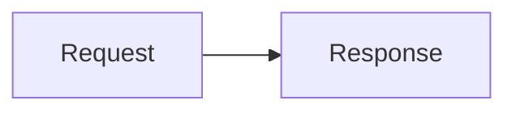

# Mermaid diagrams

T3 Code renders fenced `mermaid` blocks as diagrams in the web and desktop clients. This works in
the main chat, side chats, and other rendered Markdown views.

````markdown

````

The source remains visible while an agent streams its response. Once the response finishes, the
diagram replaces the source block. If Mermaid rejects the syntax, T3 Code keeps the source visible
instead.

Diagrams initially fit inside the pane. Use the toolbar to zoom from 25% to 200%, return to the
fitted size, copy the Mermaid source, or open a larger view. Drag shapes or empty space to pan while
zoomed in. Drag across label text to select it. The scrollbars remain available. Diagram links and
callbacks are disabled. Native mobile clients continue to show Mermaid fences as code.
